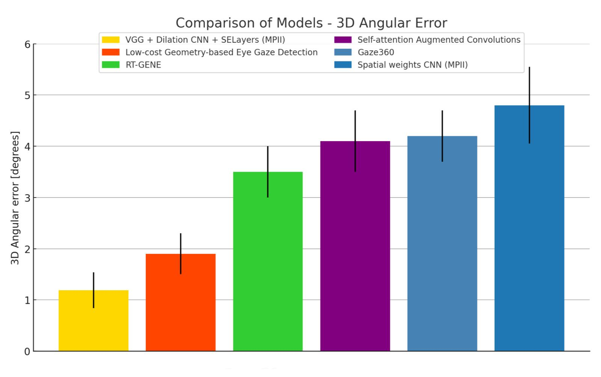

# Research-Grade Gaze Tracking and Facial Gesture Interaction System

A high-precision, appearance-based gaze tracking system enabling real-time, hands-free human-computer interaction using deep learning, geometric modeling, and personalized calibration.

This project implements a complete end-to-end pipeline for gaze estimation, from camera calibration and gaze vector prediction to personalized screen mapping and gesture-based interaction. The system is evaluated against multiple generations of gaze estimation models, including early appearance-based methods, modern full-face CNN architectures, and recent state-of-the-art systems.

The proposed architecture demonstrates highly competitive performance and strong robustness under real-world conditions using standard RGB cameras.

---

# Key Features

• Appearance-based gaze estimation using a custom CNN architecture  
• End-to-end gaze tracking pipeline  
• Personalized calibration via regression mapping  
• Real-time inference and interaction  
• Facial gesture recognition for hands-free control  
• Gaze-controlled on-screen keyboard  
• Dynamic gaze heatmap visualization  
• Modular and extensible system architecture  

---

# System Pipeline

The system consists of four main stages:

1. Camera Calibration  
   Computes intrinsic camera parameters for geometric consistency.

2. Gaze Vector Estimation  
   A convolutional neural network predicts the 3D gaze vector from facial appearance.

3. Personalized Screen Mapping  
   A regression model maps gaze vectors into screen coordinates.

4. Interaction Layer  
   Enables real-time computer interaction via gaze and facial gestures.

Pipeline overview:

Camera → Face Detection → Eye Extraction → CNN → Gaze Vector → Regression → Screen Coordinates → Interaction

---

# Model Architecture

The gaze estimation model is a custom convolutional neural network optimized for appearance-based gaze prediction under unconstrained conditions.

Architecture visualization:

The architecture was designed to:

• Extract robust gaze features from eye and facial appearance  
• Generalize across users and illumination conditions  
• Enable accurate gaze vector prediction  

Architecture diagrams were generated using PlotNeuralNet.

---

# Benchmark Evaluation Across Generations of Gaze Estimation

This project evaluates gaze estimation performance across three key generations of appearance-based gaze estimation systems, reflecting the evolution of the field.

---

## First Generation: MPIIGaze (2015) — Appearance-Based Gaze Estimation in the Wild

MPIIGaze was the first large-scale dataset collected under unconstrained, real-world conditions and established the first realistic benchmark for appearance-based gaze estimation.

The comparison below includes the original baseline model introduced alongside MPIIGaze and alternative regression-based approaches evaluated within the same experimental framework.

This generation established appearance-based CNN methods as the dominant approach over traditional regression and geometric methods.

---

## Second Generation: MPIIFaceGaze (2017) — Full-Face CNN-Based Gaze Estimation

MPIIFaceGaze introduced full-face gaze estimation and significantly improved performance compared to earlier eye-only architectures.

The proposed architecture achieves highly competitive performance compared to widely used CNN models such as:

• iTracker  
• Single-eye architectures  
• Two-eye architectures  
• Full-face CNN models  

These results demonstrate the effectiveness of the architecture compared to established full-face gaze estimation methods.

---

## Third Generation: Modern State-of-the-Art Gaze Estimation Models

This comparison includes recent appearance-based gaze estimation systems and modern architectures such as:

• RT-GENE  
• Gaze360  
• Attention-based gaze estimation models  
• Geometry-based and hybrid gaze tracking systems  

The proposed model is shown in yellow.

The results demonstrate strong performance compared to modern gaze estimation systems, highlighting the effectiveness of the architecture and training methodology.

---

# Personalized Calibration Performance

A regression-based calibration stage significantly improves screen-space accuracy by adapting the system to individual users.

Pixel error decreases as calibration sample size increases:

Regression parity plots:

This calibration step enables precise gaze-based interaction using standard RGB cameras.

---

# Real-Time Interaction Capabilities

The system supports real-time interaction, including:

• Cursor control via gaze  
• Gesture-based action triggering  
• Gaze-controlled virtual keyboard  
• Real-time gaze visualization  
• Temporal smoothing for stability  

Example:

---

# Installation

Install dependencies:

    pip install -r requirements.txt

---

# Usage

## Step 1 — Camera Calibration

Extract camera intrinsic parameters:

    python src/data_collection/camera_calibration.py

Requires a standard chessboard calibration pattern.

---

## Step 2 — Train or Load Gaze Model

Optional: train the model using MPIIFaceGaze:

    python src/train/preprocess_mpii_dataset.py
    python src/train/training.py

Alternatively, use the provided pretrained model.

---

## Step 3 — Personalized Calibration

Collect calibration data:

    python src/data_collection/data_collection.py

Train regression model:

    python src/regressor/gaze_csv.py
    python src/regressor/regression.py

---

## Step 4 — Run Real-Time Demo

    python src/demo/main_demo.py

Optional arguments:

    --calibration_matrix_path
    --model_path
    --monitor_mm
    --monitor_pixels
    --visualize_preprocessing
    --smoothing
    --heatmap
    --keyboard

---

# Project Structure

    src/
        data_collection/
        train/
        regressor/
        demo/

    docs/
        CNN_graph/
        results/
        demo_examples/

---

# Applications

This system is suitable for:

• Assistive technologies  
• Accessibility interfaces  
• Human-computer interaction research  
• Hands-free computer control  
• AR/VR interaction systems  
• Attention tracking  
• Behavioral analysis  

---

# Technical Summary

This project demonstrates a complete appearance-based gaze estimation pipeline combining:

• Deep learning  
• Geometric modeling  
• Personalized calibration  
• Real-time interaction  

The system achieves strong performance across multiple gaze estimation benchmarks and enables accurate, real-time gaze-based computer interaction using standard hardware.

---

# License

MIT License