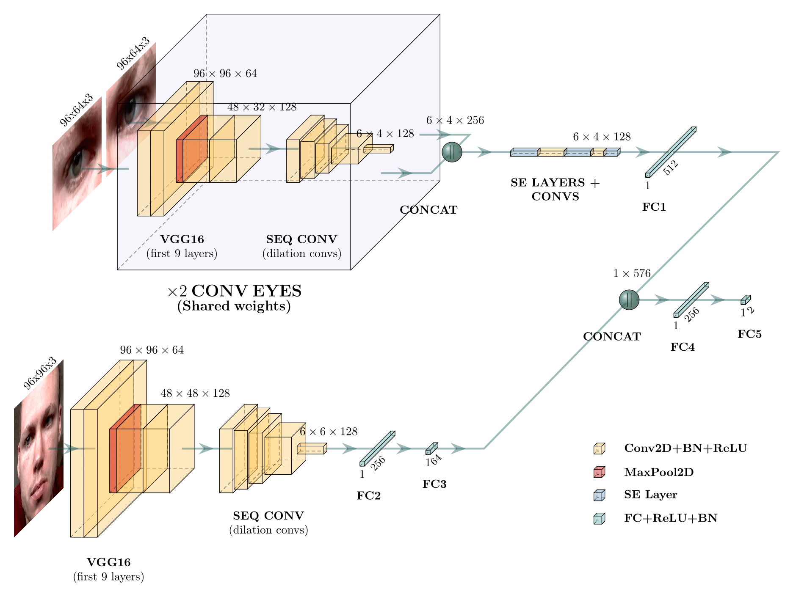
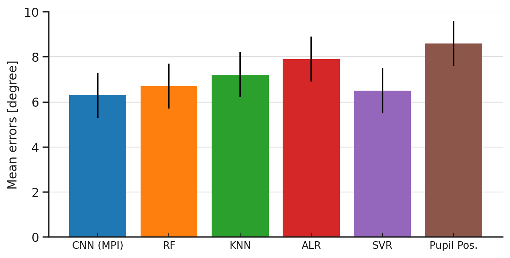
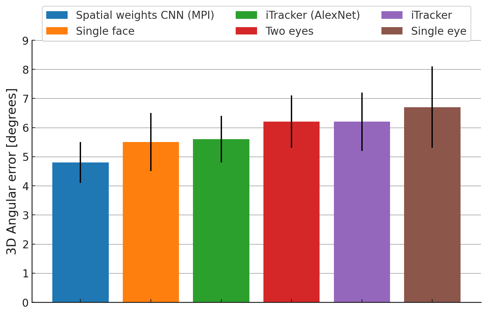
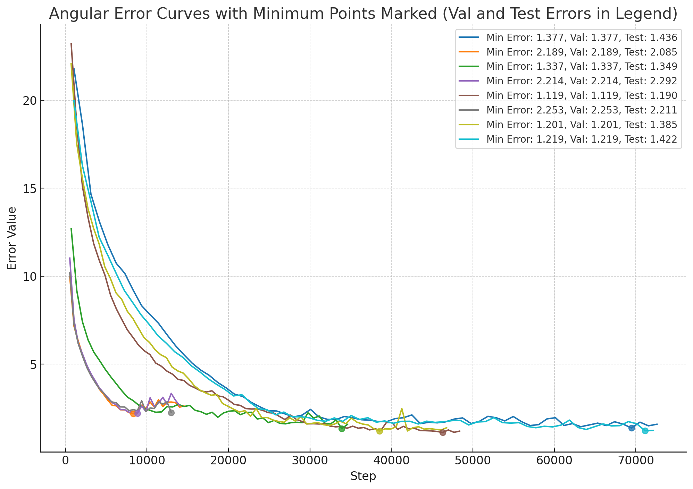
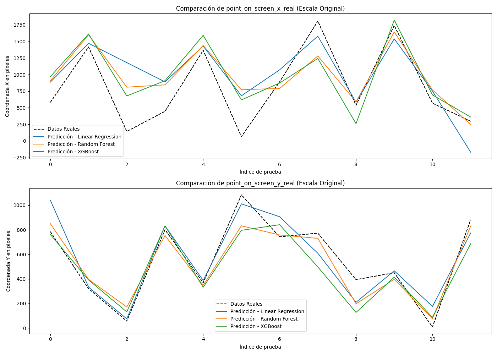
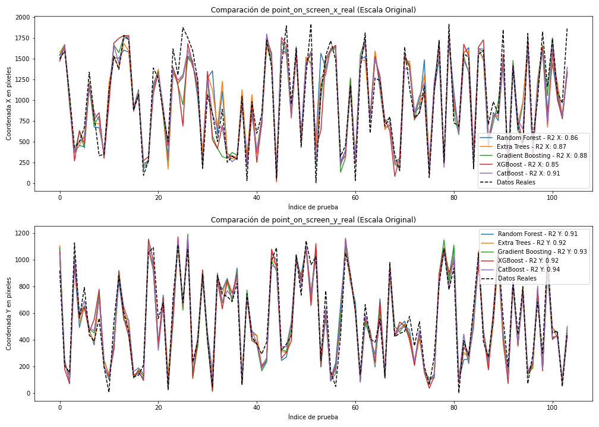
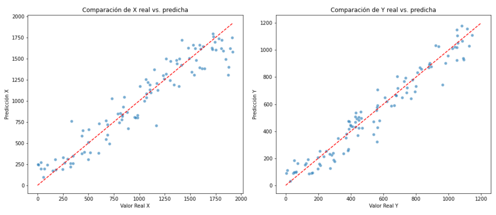
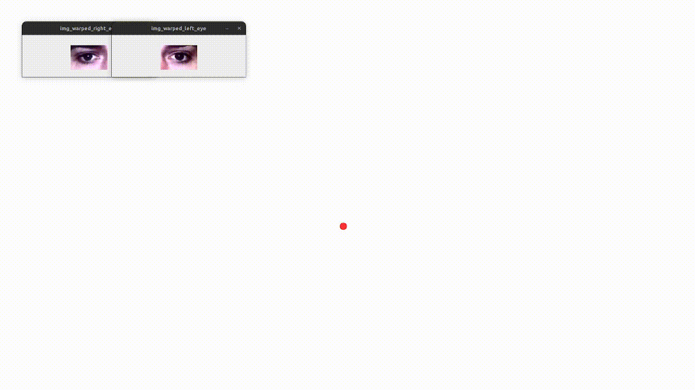

# Proyecto de Fin de Máster: Gaze Tracking e Interacción mediante Gestos Faciales

Este proyecto forma parte del trabajo final de máster de **Data Science**. El objetivo principal es implementar un sistema de interacción con el ordenador que permita a los usuarios utilizar su mirada como input, así como realizar acciones mediante gestos o movimientos de la cabeza y la cara, utilizando técnicas avanzadas de *computer vision*.

## Descripción del Proyecto

El proyecto está enfocado en desarrollar una tecnología que facilite la interacción con dispositivos mediante el seguimiento de la mirada (*gaze tracking*) y el reconocimiento de gestos faciales. Esto permite a los usuarios controlar el ordenador sin necesidad de utilizar sus manos, lo que puede ser de gran utilidad en aplicaciones de accesibilidad, entretenimiento o escritura entre otras opciones.

### Metas del Proyecto

1. **Desarrollo de un Sistema de Gaze Tracking**: Implementar un sistema robusto que utilice la mirada del usuario como input para controlar el ordenador.
2. **Interacción Mediante Gestos Faciales**: Desarrollar métodos para reconocer gestos faciales y movimientos de la cabeza, permitiendo realizar acciones en el ordenador sin contacto físico.
3. **Integración de Computer Vision**: Emplear técnicas de visión por computadora para mejorar la precisión y la experiencia del usuario en la interacción con el sistema.

### Dependencias

Para ejecutar el proyecto, asegúrate de instalar las dependencias necesarias. Puedes instalarlas ejecutando:

```bash
pip install -r requirements.txt
```

## Ejecución

1. El proyecto incluye el script `src/data_collection/camera_calibration.py` para extraer la matriz de la cámara (distancias focales y coeficientes de distorsión), archivo necesario para ejecutar la demo. Para ello únicamente se necesitará un _chess grid_.
2. **(Opcional)** Preprocesar el dataset MPIIFaceGaze con `src/train/preprocess_mpii_dataset.py` y entrenar el modelo con tus propios parámetros usando `src/train/training.py` **(o usar el modelo subido)** 
3. Realizar el fine-tuning final mediante la recopilacion de imagenes propias usando `src/data_collection/data_collection.py` y el posterior entrenamiento del modelo de regresión `src/regressor/gaze_csv.py` y `src/regressor/regression.py`. Como se puede comprobar en las gráficas de resultados del modelo de regresión, cuantas más imágenes utilices, mejores resultados obtendrás.
3. Ejecutar el script de demostracion :

```bash
python src/demo/main_demo.py
```
Puedes introducir los siguientes parámetros para probar las diferentes funcionalidades:

```bash
optional arguments:
  -h, --help                      Show this help message and exit
  --calibration_matrix_path       Ruta al archivo de la matriz de calibración de la cámara
  --model_path                    Ruta al modelo de prediccioón de mirada
  --monitor_mm                    Tamaño del monitor en milímetros (ancho,alto)
  --monitor_pixels                Tamaño del monitor en píxeles (ancho,alto)
  --visualize_preprocessing, -vp  Visualizar las imágenes preprocesadas de cara y ojos
  --smoothing, -s                 Aplicar suavizado EMA al punto de predicción de mirada
  --heatmap, -hm                  Mostrar heatmap variable de mirada en una imagen
  --keyboard, -k                  Mostrar un teclado en pantalla para escribir texto mediante la mirada y gestos faciales (por dejecto, fruncido del ceño)
  ``` 

## Modelo utilizado
En la carpeta docs se encuentra la arquitectura de red utilizada para la predicción del vector de mirada, y todos los archivos y código utilizado para conseguirla.
Se han utilizado los recursos del respositorio [PlotNeuralNet](https://github.com/HarisIqbal88/PlotNeuralNet) de Haris Iqbal para graficar la estructura por capas mediante LaTex. En caso de ver su funcionamiento puedes usar un simple editor de Tex y compilar los archivos .tex.

### Representación gráfica



## Resultados comparativos

A continuación se muestran las siguientes comparativas de errores angulares obtenidos con diferentes modelos:

1. Primeros modelos de seguimiento de mirada en comparación con el modelo presentado junto al dataset de MPIIGaze: [Appearance-Based Gaze Estimation in the Wild, Zhang et al. (2015)](https://arxiv.org/pdf/1504.02863v1)
 

2. Modelo presentado junto al dataset utilizado en este proyecto (_MPIIFaceGaze_) en comparación con modelos más modernos basados en CNN: [It’s Written All Over Your Face: Full-Face Appearance-Based Gaze Estimation" de Zhang et al. (2017)](https://ieeexplore.ieee.org/document/8015018)


3. Gráficas de error angular obtenido en los diferentes modelos entrenados en este proyecto con el dataset _MPIIFaceGaze_
 

## Resultados de modelo de regresión

A continuación se muestran las graficas de error en píxeles mediante el modelo regresivo a medida que aumenta el número de datos:
 
 
 
 

## Ejemplos

Puedes encontrar más ejemplos en el directorio `docs/demo_examples/`
 


